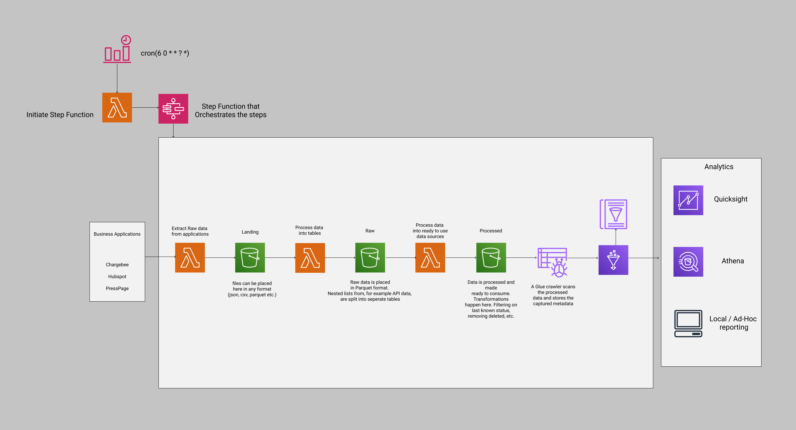

# Quicksight

This project contains the source code for our Data extractions and integrations into AWS Quicksight
The project is build based on a AWS SAM template. This can be found in template.yaml

The application is build based on the following:

- Lambda job to start a step function
- Step function that orchestrates the entire ETL.
- Lambda function that downloads the application data from supplied APIs. Every endpoint gets it own process.
  - Data is stored in any format
- Extracted data gets initially processed and stored on S3 in Parquet format
    - creating separate files from nested objects
    - fixing column types
    - setting timestamps to UTC   
- Raw data will be further processed and stored on S3 in Parquet format. This data is ready for 
  different analytical tools and ready to be used for any data ingestion and reporting

# Quicksight

## Chargebee

### Download and process data
- State machine that orchestrates scripts to download raw data and clean it. State machine gets initiated
by lambda function, started by Cron
  
- Last updated timestamp is stored in Secrets Manager and used in the api call to only get updated data. 
  Allows a higher frequency of downloads if necessary
  
- When downloads and processing are done, kicks off the next state machine; latest

### Latest Data
- State machine that created and ingests the last known status of all data
- Lambda function that Create tables with only the latest known values Chargebee 
    - groupby id and sort by updated_at and give row numbers (RN) . Filter where RN = 1
    - if a subscription is deleted at any time, filter all occurences from data
    - store on S3 as parquet as latest-<table_name>
    - Is merged with Exchange Rates data to calculate EUR prices for everything 
- Lambda function that kicks off glue crawler to load data into tables
- Lambda function to refresh datasets in Quicksight 
  - NOTE: Initial adding of data needs to be done manually and ID added to step function parameters
    
### Monthly Data
- Data ran once a month with a report of the status of previous month. Ran separately because filtering is different 
  and comparisons with prev month need to be made.
  
- Uses two levels of processing
  - Create tables filtered on last month. ALso includes exchange rates of the first day of the next month
  - Compares this month to previous month. Necessary to split because the wrapped up data needs to be loaded

# S3 Data Lake structure
Buckets
- LANDING
  - APPLICATION
    - ENDPOINT
      - PARTITION
    example: landing_bucket/chargebee/subscriptions/eu/
- RAW
  - APPLICATION
    - TABLE
        - PARTITION
    example: raw_bucket/chargebee/addons/eu/ 
- PROCESSED
    - TYPE
        - TABLE
    example: processed_bucket/monthly/processed/
          
* Landing - a temporary store with data extracted from the source systems.
* Raw - This is the primary bucket which contains the primary ‘data lake’. 
  If source data has nested lists, these are processed and transformed into individual tables here.
* Processed - This is the latest snapshot of raw data that has had transformations applied. 
  Transformations can include basic views, restructuring the data, joins of tables. 
  Any ad-hoc reporting is done in this stage. These tables can be loaded into analytics platforms like quicksight

